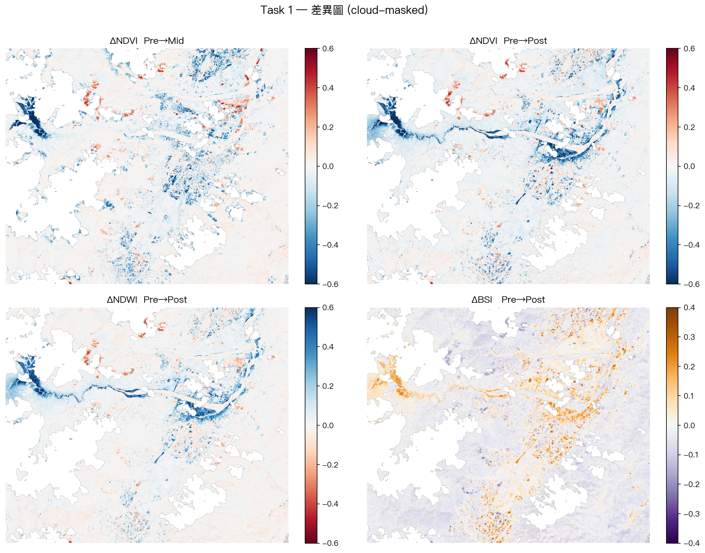
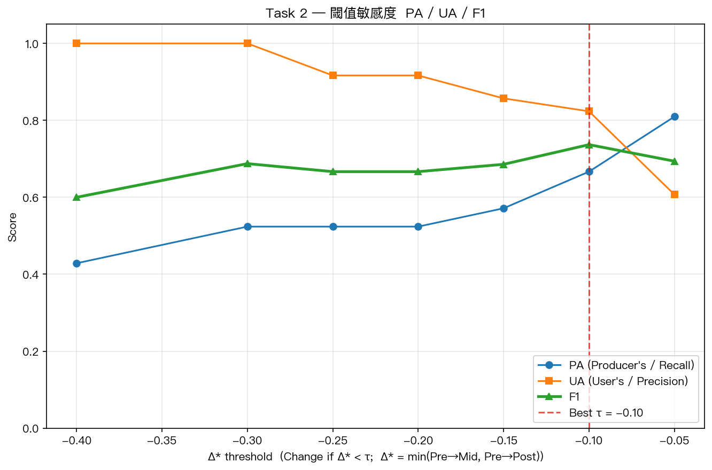
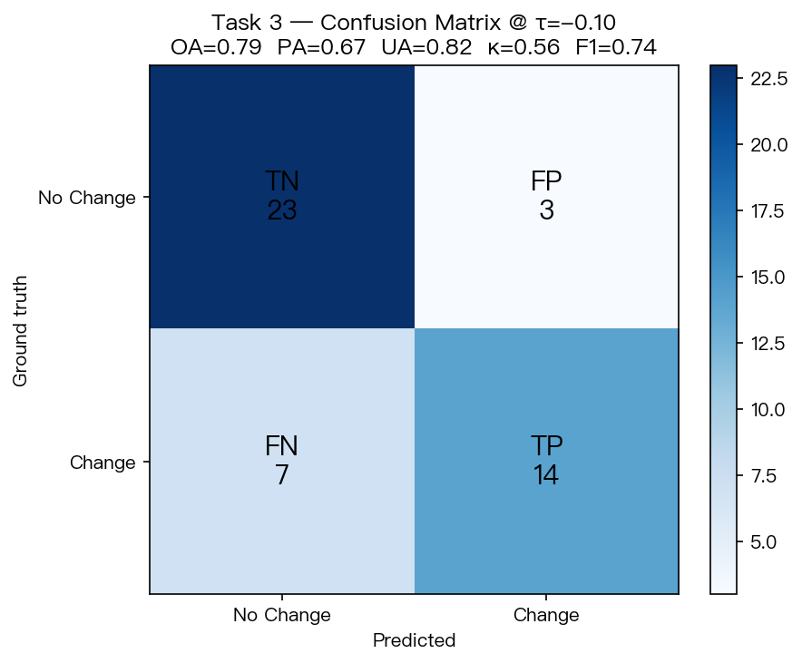
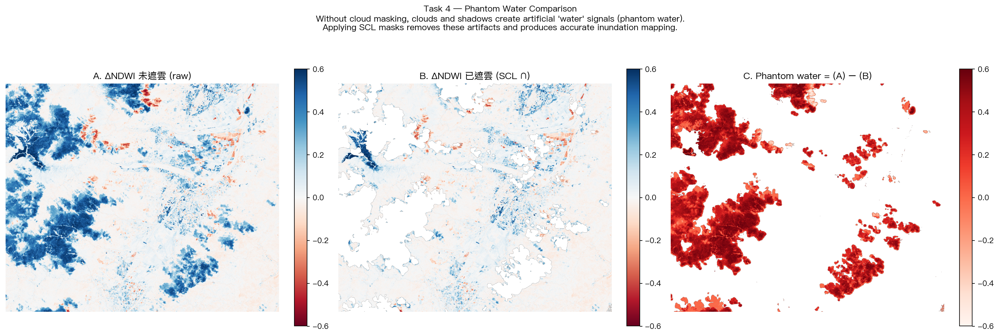
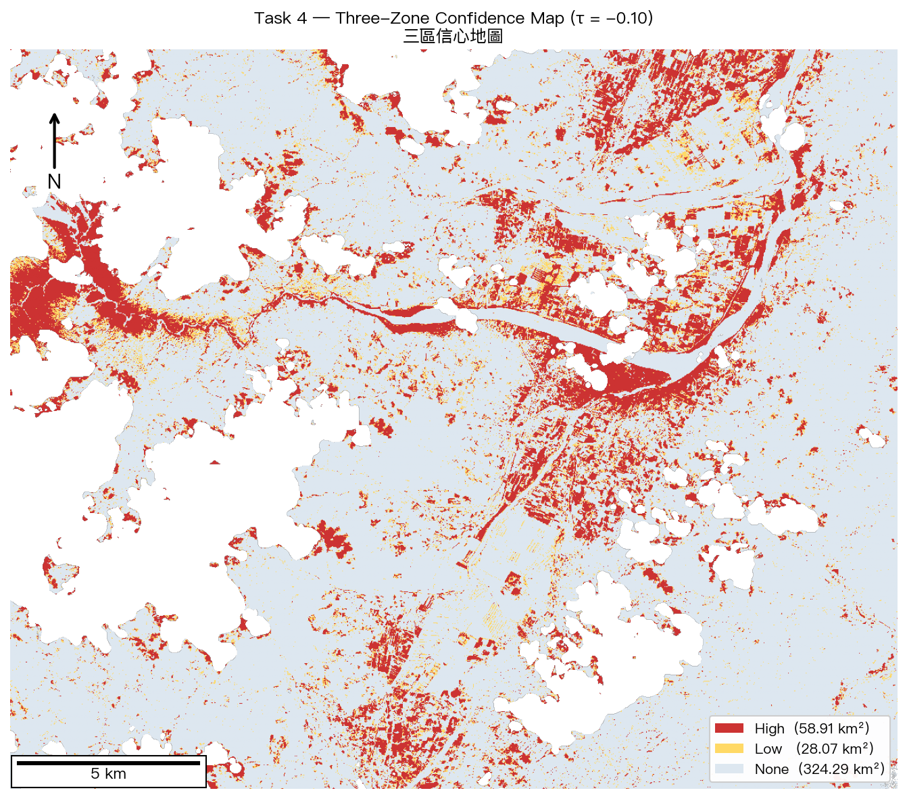

# Week 9 — ARIA v6.0 Validated Auditor

NTU 遙測與空間資訊之分析與應用 (Prof. Su Wen-Ray) — Week 9 Homework
**Case study:** Matai'an Barrier Lake (Typhoon Colo, 2025-08 ~ 2025-10)
**Author:** Jung (jung16705@gmail.com)

---

## 內容

`Week9_ARIA_v60_Jung.ipynb` 是單一交付 notebook，每個步驟一個 cell，
前面都附上中文 `## 階段 N` 說明。完整覆蓋 `Homework-Week9.md` 規範的 7 大任務：

| Task | 內容 | 對應階段 |
|---|---|---|
| 1 | NDVI / NDWI / BSI 三指標差異圖 + 統計表 | 階段 6 – 8 |
| 2 | 閾值掃描 PA / UA / F1 | 階段 11 – 12 |
| 3 | Confusion Matrix + Cohen's κ | 階段 13 |
| 4 | Phantom-water 對照 + 三區信心地圖 (km²) | 階段 9 + 14 |
| 5 | ARIA v6.0 災害驗證報告 (Markdown) | 階段 15 |
| 6 | AI Advisor 提示 + LLM 回覆 + 反思 | 階段 16 |
| 7 | Week 8 vs Week 9 跨週比對 | 階段 17 – 18 |

---

## 成果摘要

本次作業以 Sentinel-2 L2A 三幕影像建立 cloud-masked change detection workflow，並使用老師提供的 60 個驗證點計算精度。核心結果如下：

| 指標 | 結果 |
|---|---:|
| Best threshold | `Δ* < -0.10` |
| Overall Accuracy (OA) | 78.7% |
| Producer's Accuracy (PA) | 66.7% |
| User's Accuracy (UA) | 82.4% |
| Cohen's Kappa | 0.56 |
| F1-score | 0.74 |
| High-confidence change area | 58.91 km² |
| Low-confidence change area | 28.07 km² |
| No-detection area | 324.29 km² |

> `58.91 km²` 是整個 AOI 內的高信心 land-cover / vegetation-loss footprint，包含湖區、崩塌、裸露沉積與河道變化，不是單一湖面面積。

### Task 1: Difference Maps



**圖說與判讀重點：**  
這張 2×2 panel 是本作業最核心的 cloud-masked change detection 成果。左上、右上分別比較 Pre→Mid 與 Pre→Post 的 ΔNDVI；藍色代表 NDVI 下降，也就是植被消失、裸露、淹水或崩塌造成的植被損失。左下的 ΔNDWI 用來確認水體或濕潤區增加，右下的 ΔBSI 則用來輔助辨識裸露土壤、沉積與 debris-flow corridor。圖中主要變化集中在河道、湖區與下游沖積/裸露區，表示偵測訊號不是隨機散布，而是和事件地貌位置一致。

**對應數據：** `H1_delta_stats.csv` 記錄每個差異圖層的 min / mean / max；例如 ΔNDVI Pre→Mid 最低約 `-0.91`，ΔNDWI Pre→Mid 最高約 `+0.97`，符合「植被下降、水體訊號上升」的災害變化型態。

- 統計表：[`output/H1_delta_stats.csv`](output/H1_delta_stats.csv)

### Task 2: Threshold Optimization



**圖說與判讀重點：**  
這張圖比較不同 ΔNDVI threshold 下的 Producer's Accuracy (PA)、User's Accuracy (UA) 與 F1-score。threshold 越寬鬆，例如 `-0.05`，會抓到較多真實變化，因此 PA 較高，但 false alarm 也增加，使 UA 降低；threshold 越嚴格，例如 `-0.40`，UA 變高但漏報增加，PA 下降。紅色虛線標示 F1 最高的最佳 threshold。

**結論：** 最佳門檻為 `Δ* < -0.10`，F1 = `0.74`。這個門檻在「不要漏掉太多真實災害變化」與「不要把太多穩定區誤報為變化」之間取得較好的平衡。

- 閾值掃描表：[`output/HW_T2_threshold_sweep.csv`](output/HW_T2_threshold_sweep.csv)

### Task 3: Confusion Matrix



**圖說與判讀重點：**  
這張 confusion matrix 使用老師提供的 ground-truth validation points 評估最佳 threshold。縱軸是真實類別，橫軸是模型預測類別。結果為 TN = `23`、FP = `3`、FN = `7`、TP = `14`。也就是 21 個實際變化點中抓到 14 個，26 個實際穩定點中正確排除 23 個。

**結論：** Overall Accuracy = `78.7%`、PA = `66.7%`、UA = `82.4%`、Kappa = `0.56`、F1 = `0.74`。UA 高於 PA，代表被標成 change 的區域多半可信，但仍有約三分之一真實變化被漏掉，因此不能把 no-detection area 解讀成完全安全。

- 精度表：[`output/HW_T3_metrics.csv`](output/HW_T3_metrics.csv)

### Task 4: Phantom Water and Confidence Map



**圖說與判讀重點：**  
這張圖專門展示老師要求的 phantom-water error case。左圖是沒有使用 SCL 雲遮罩的 raw ΔNDWI，中圖是套用三幕交集 SCL mask 後的 ΔNDWI，右圖標出被遮罩移除的假訊號。未遮雲時，大面積雲與雲影會在 ΔNDWI 中形成類似水體增加的藍色訊號，造成「假水體」。

**結論：** 未遮雲的 `ΔNDWI > 0.10` 像素數為 `319,165`，遮雲後降為 `87,871`，約 `72.5%` raw water-like signal 是雲/雲影造成或受其污染。這證明 SCL cloud masking 是本作業必要步驟，不是美化圖面的選項。



**圖說與判讀重點：**  
這張三區信心地圖把最佳 threshold 轉成 operational zones：紅色為 High Confidence，黃色為 Low Confidence，淺色為 No Detection。High zone 表示 ΔNDVI loss 強於 `1.5 × threshold`，是最值得優先調查或管制的核心變化區；Low zone 是 borderline change，需要後續 VHR 或 SAR 重新確認；No Detection 則表示未超過本次光學影像的變化門檻。

**結論：** High-confidence area = `58.91 km²`，Low-confidence area = `28.07 km²`，No-detection area = `324.29 km²`。紅色區域沿河道、湖區、裸露/沉積帶與部分農地變化分布，因此應解讀為「高信心地表變化 footprint」，不是單一湖面面積，也不是直接等同所有紅色像素都需撤離。

- 三區面積表：[`output/HW_T4_zone_areas.csv`](output/HW_T4_zone_areas.csv)

### Task 5–7: Reports and Tables

| Deliverable | 檔案 |
|---|---|
| ARIA v6.0 disaster report | [`output/HW_T5_ARIA_v60_report.md`](output/HW_T5_ARIA_v60_report.md) |
| AI Advisor prompt | [`output/HW_T6_AI_prompt.txt`](output/HW_T6_AI_prompt.txt) |
| AI Advisor response + reflection | [`output/HW_T6_AI_response.md`](output/HW_T6_AI_response.md) |
| Week 8 impacted assets | [`output/HW_T7_w8_impacted_assets.csv`](output/HW_T7_w8_impacted_assets.csv) |
| Week 8 vs Week 9 comparison | [`output/HW_T7_w8_vs_w9.csv`](output/HW_T7_w8_vs_w9.csv) |

---

## 執行方式

```bash
# 1. 建立 venv
python3 -m venv .venv
source .venv/bin/activate            # Windows: .venv\Scripts\activate

# 2. 安裝套件
pip install -r requirements.txt

# 3. 設定環境變數
cp .env.example .env
# 編輯 .env，填入你自己的 PRE_ITEM_ID / MID_ITEM_ID / POST_ITEM_ID
# (取得方式見下節「如何取得 STAC item ID」)

# 4. 註冊 kernel
python -m ipykernel install --user --name week9-venv --display-name "Python (Week9 venv)"

# 5. 執行 notebook
jupyter lab Week9_ARIA_v60_Jung.ipynb
# kernel 切到 "Python (Week9 venv)" → Run All
```

### 如何取得 STAC item ID

`.env.example` 內的 `PRE_ITEM_ID=...YYYYMMDD...` 是 placeholder，必須先換成
**真實的 Sentinel-2 L2A item ID** 才能跑 ONLINE 模式：

1. 開瀏覽器到 [Microsoft Planetary Computer Explorer](https://planetarycomputer.microsoft.com/explore?c=121.4%2C23.66&z=10&v=2)
2. 在 search panel 選 collection = `Sentinel-2 Level-2A`
3. 對 Pre / Mid / Post 三個目標日期分別調 date filter，AOI 用上面的座標範圍
4. 找雲量最低的影像，右鍵點 item 卡片 → Copy ID（54 字元字串，類似
   `S2A_MSIL2A_20250615T023141_R046_T51QUG_20250615T070417`）
5. 把三個 ID 貼到 `.env` 的對應欄位

**或者**：直接用我用過的這三個（馬太鞍颱風 Colo 案例）：

```
PRE_ITEM_ID=S2A_MSIL2A_20250615T023141_R046_T51QUG_20250615T070417
MID_ITEM_ID=S2C_MSIL2A_20250911T022551_R046_T51QUG_20250911T055914
POST_ITEM_ID=S2B_MSIL2A_20251016T022559_R046_T51QUG_20251016T042804
```

> 若不填或 PC 連線失敗，notebook 會自動 fallback 到 100 m 合成資料以維持
> pipeline 可跑性，但精度數字會與真實 Sentinel-2 不同。

線上模式 (預設) 從 Microsoft Planetary Computer 抓真實 Sentinel-2 L2A ~22 m 像素，
三幕合計約 100 MB。網路失敗會自動 fallback 到合成模式 (教學用)。

---

## 目錄結構

```
.
├── README.md                     # 本檔
├── .gitignore                    # 排除 .env / .venv / cache
├── .env.example                  # 環境變數範本 (複製成 .env 並填值)
├── requirements.txt              # Python 套件清單
├── Week9_ARIA_v60_Jung.ipynb     # 主交付 notebook
├── _build_clean_notebook.py      # 重新產生 notebook 的 build script
├── validation_points.geojson     # 老師提供的 60 個真值點
├── week8_impact_table.csv        # Week 8 Eyewitness Impact Table (Task 7)
├── Homework-Week9.md             # 作業規範
├── Pre-lab-Week9.md              # 課前準備說明
└── output/                       # 所有產出 (執行 notebook 後自動更新)
    ├── HW_T1_difference_maps.png      # Task 1: 2x2 Δ-map
    ├── H1_delta_stats.csv             # Task 1: min/mean/max 統計
    ├── HW_T2_pa_ua_f1_curve.png       # Task 2: 閾值掃描曲線
    ├── HW_T2_threshold_sweep.csv      # Task 2: 完整掃描表
    ├── HW_T3_confusion_matrix.png     # Task 3: 混淆矩陣熱圖
    ├── HW_T3_metrics.csv              # Task 3: OA/PA/UA/κ/F1
    ├── HW_T4_phantom_water.png        # Task 4 必交：phantom-water 對照
    ├── HW_T4_confidence_map.png       # Task 4: 三區信心地圖
    ├── HW_T4_zone_areas.csv           # Task 4: km² 表
    ├── HW_T5_ARIA_v60_report.md       # Task 5: 災害報告 Markdown
    ├── HW_T6_AI_prompt.txt            # Task 6: AI Advisor 提示
    ├── HW_T6_AI_response.md           # Task 6: LLM 回覆 + 反思
    ├── HW_T7_w8_impacted_assets.csv   # Task 7: Week 8 命中資產摘要
    └── HW_T7_w8_vs_w9.csv             # Task 7: 跨週比對表
```

---

## 主要設計決策

1. **變化偵測信號 = Δ\* = min(ΔNDVI Pre→Mid, Pre→Post)**
   單一 Pre→Post 會漏掉已排空的湖；取兩個時段中「最強的植被損失」可同時抓
   湖 (Mid 出現) 與崩塌 (Mid+Post 持續)。

2. **三幕交集 valid = valid_pre ∩ valid_mid ∩ valid_post**
   任一幕有雲就剔除，避免 ΔNDWI 出現 phantom water。

3. **所有報告數字皆從上游變數計算 (no hard-coded values)**
   重跑 notebook 會自動更新 `output/HW_T5_ARIA_v60_report.md` 與
   `output/HW_T6_AI_response.md`，不會留下舊資料殘影。

4. **線上 / 離線雙模式**
   `_build_clean_notebook.py` 會優先嘗試 Planetary Computer，失敗時自動切到
   合成 fallback，notebook 一律可跑完。

---

## 授權 / 聲明

本專案為 NTU 遙測與空間資訊之分析與應用 課程作業；資料 / 程式碼僅供學術
學習使用。`.env` 內含 STAC item ID，**不可推送至公開倉庫**
(`.gitignore` 已排除)。
